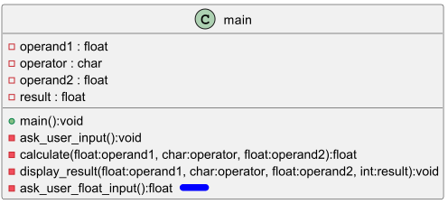

# Evaluation I

Ce dépôt a été créé à des fin d'évaluation.

## Comment débuter l'évaluation

* "Clone" le dépôt à l'aide de PyCharm.
* Exécuter-le pour valider que le programme actuel fonctionne bien sur votre environnement.
* Activer git flow pour créer la branche "develop".

```
  git flow init
```

* !!! IMPORTANT - ne publiez pas votre code (git push) avant la fin de l'examen. !!!

## TODO

Vous devez réaliser 2 tâches durant cette évaluation.

### Tâche 01 - Une fonction spécifique pour récupérer les opérandes



* Voici le code final à utiliser pour la fonction "ask_user_input()"

```python
    def ask_user_input():
        # Get first operand from the user
        global operand1
        operand1 = ask_user_float_input("Enter the first operand: ")
    
        global operator
        # Get the operator from the user
        operator = input("Enter an operator (+, -, *, /): ")
    
        global operand2
        # Get second operand from the user
        operand2 = ask_user_float_input("Enter the second operand: ")
```

* Optionnel - vous commitez avec le commentaire suivant "refactor: externalize the logic to ask and retrieve a float"

### Tâche 02 - Opérateur puissance

* Ajouter la possiblité à vos utilisateurs de pouvoir faire des puissances

```python
    # Fonction puissance
    def maFonction(n):
      somme = 1
      for count in range(int(n)):
        somme = somme * 2
      return somme
    
    #Ce print sert à tester la fonction
    print(maFonction(3))
```

* Optionnel - vous commitez avec le commentaire suivant "feat: power operator"

# Livrable

Une fois terminé, vous pouvez:

* soit continuer de travailler sur votre poste, 
* soit aller en pause. 
 
De retour à 12h00 pour la livraison du code.

